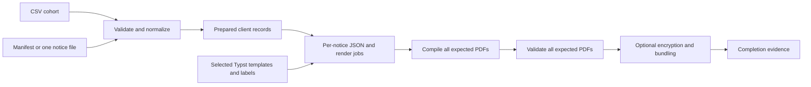

# Workflow and output evidence

`immuknow.orchestrator.run_pipeline` owns a complete run; `immuknow` is its CLI.
The run loads configuration, prepares clients, resolves their notices, renders
and validates every expected PDF, then completes delivery. The selected
filename sets each client's `version_id` and language. Typst independently
checks both.

For a first read, start with `run_pipeline` and follow its numbered comments:
check inputs, prepare output, prepare clients, add QR codes, compile notices,
validate PDFs, deliver copies and bundles, then record completion. Optional
steps stay in that sequence and use configuration to decide whether to act.

The names describe different points in that sequence:

- A **client record** contains prepared source information and its assigned
  notice version and language.
- A **render job** pairs that client with the template, data file, and expected
  PDF path. Preparing a job does not create the PDF.
- A **bundle** combines completed individual PDFs for delivery.
- The **completion record** lists the outputs of a successful run.

The preparation flow follows the source record through these steps:

1. Read the CSV once as text, trim surrounding whitespace once, and validate
   those prepared values against the selected schema. A required schema error
   rejects the whole file.
2. Exclude incomplete addresses and clients that pass a permissive custom
   schema with incomplete essential fields. Write separate CSV reports.
3. Check school names against the reference list and load vaccine references, then build client records with
   normalized disease names, age and eligibility, and parsed history.
4. Reconcile notice assignments. The orchestrator then saves the prepared
   client artifact.

`preprocess.prepare_clients` returns the cohort and reconciliation findings,
or raises with the findings when assignments fail preflight. The orchestrator
reports those findings and controls whether rendering and delivery proceed.
History parsing and normalization remain helpers within client preparation.

The cohort and render jobs persist under `artifacts/` when configured to retain
them. A render job names the client, sequence, version, language, selected
template, data path, bounded workspace, and expected PDF. Small JSON payloads
supply validated client data. Typst formats dates, labels, dose wording,
headings, and notice prose. The selected template tree and language
dictionaries are
staged once per run. No generated Typst source or client-specific wrapper is
needed. The [authoring guide](../user_guide/phu_templates.md) defines the JSON.

After preparing the output directory, `run_pipeline` owns run logging in
`logs/run_<run_id>.log`. The file covers application stages. Stage modules
emit logger messages but do not change global logging. The run removes its
handler on exit and preserves the caller's logging configuration, including
when a stage fails.

The renderer publishes a PDF only after compilation succeeds, then records
successful completion for the whole expected set. Validation checks each
expected PDF and its client ID, plus configured page and layout rules. An
error-level finding stops the run. Encryption and bundling use the same notice
set and check identity and uniqueness, not just counts. Stale PDFs and
encrypted duplicates are excluded. Language labels filenames but never filters
the cohort. Bundles can group by size, school, or board across languages.

Run metadata distinguishes resolved selection from successful compilation,
validation, and final delivery. Client-linked diagnostics are sensitive; store
them with the run's output. Installed library resources come from the
`immuknow` package; selected PHU configuration and templates can live
elsewhere. Writes go to the caller's output directory.
