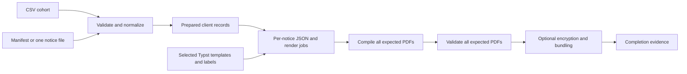

# Workflow and output evidence

## Browser playground

The static playground uses Typst.ts (Apache-2.0), with
the JavaScript API pinned to `0.8.0-rc3`. Its published WASM reports
`sys.version == version(0, 15, 0)` and is unsuitable for the production pin.
Build the WASM from Typst.ts commit
`9739d81c5eaee02d2dc9c4e691262a3f6758cdc4` using its locked dependencies,
Rust `1.92.0`, and wasm-bindgen `0.2.118`. That lockfile selects the patched
Typst `0.15.1` revision `59b5999da8e74e74583069408d2564fc1f9bc973`.
The compiler worker asserts the version inside the running WASM before compiling a
notice. Production continues to use the official Typst `0.15.1` binary.

[Typst Online Editor](https://github.com/Mapaor/typst-online-editor) (MIT)
demonstrates browser PDF compilation and preview with Typst.ts and PDF.js;
[typst-web](https://github.com/ost-fh/typst-web) offers web editor components.
A small Vite application avoids adopting an entire editor application and
its deployment conventions. Compiler files and the checksum-verified native
FreeFont archive are served locally; default remote font loading is disabled.
The editor uses CodeMirror 6 (MIT), PDF.js 6.4.299 (Apache-2.0), and fflate
0.8.3 (MIT); exact direct and transitive versions are locked in
`playground/package-lock.json`. PDF.js displays the compiled PDF bytes used by
export. A single worker owns compilation; revision checks discard superseded
results. An inert filesystem fallback and package resolver prevent arbitrary
source from fetching remote resources. The CSP also confines runtime requests
to the site's origin. No multithreading or cross-origin isolation is required.

A deterministic build assembles canonical template/package/configuration bytes
and real prepared synthetic payloads. JavaScript never reimplements clinical
preparation or Typst display projection. Local drafts hold changed source bytes;
ZIP export preserves these and records hashes, package/compiler versions, and
the entry point. Imports are bounded and validated in a separate worker.
Production stages the same sources with its own real prepared payloads.

Browser tests exercise every maintained template/example pair, errors, draft
persistence, missing assets, worker recovery, and third-party request blocking.
PDF comparisons check semantic text, geometry, and raster output. The mandatory
edited-project test installs a wheel outside the checkout and runs both CLI
selectors against the exported tree with empty Typst package caches.

The docs workflow builds one `site/` artifact containing MkDocs and
`site/playground/`. Its base comes from `site_url` in `mkdocs.yml`. Pull requests
build and test the artifact without publishing; main pushes deploy the complete
artifact to `gh-pages` using the existing deployment job. GitHub Pages must be
configured to serve that branch. Dependency notices and the font license ship
with the static assets.

## Production workflow

`immuknow.orchestrator.run_pipeline` owns a complete run; `immuknow` is its CLI.
The run loads configuration, prepares clients, resolves their notices, renders
and validates every expected PDF, then completes delivery. The selected
filename sets each client's `version_id` and language. Typst independently
checks both.

For a first read, start with `run_pipeline` and follow its numbered comments:
check inputs, prepare output, prepare clients, add QR codes, compile notices,
validate PDFs, deliver copies and bundles, then record completion. Optional
steps stay in that sequence and use configuration to decide whether to act.

The names describe different points in that sequence:

- A **client record** contains prepared source information and its assigned
  notice version and language.
- A **render job** pairs that client with the template, data file, and expected
  PDF path. Preparing a job does not create the PDF.
- A **bundle** combines completed individual PDFs for delivery.
- The **completion record** lists the outputs of a successful run.

The preparation flow follows the source record through these steps:

1. Read the CSV once as text, trim surrounding whitespace once, and validate
   those prepared values against the packaged input schema. A required schema error
   rejects the whole file.
2. Exclude incomplete mailing addresses and write their CSV report. Essential
   client fields have already passed the required schema checks.
3. Check school names against the reference list and load the vaccine-to-disease mapping, then build client records with
   normalized disease names, age and eligibility, and parsed history.
4. Reconcile notice assignments. The orchestrator then saves the prepared
   client artifact.

`preprocess.prepare_clients` returns the cohort and reconciliation findings,
or raises with the findings when assignments fail preflight. The orchestrator
reports those findings and controls whether rendering and delivery proceed.
History parsing and normalization remain helpers within client preparation.

The cohort and render jobs persist under `artifacts/` when configured to retain
them. A render job names the client, sequence, version, language, selected
template, data path, bounded workspace, and expected PDF. Small JSON payloads
supply validated client data. Typst formats dates, labels, dose wording,
headings, and notice prose. The selected template tree and language
dictionaries are
staged once per run. No generated Typst source or client-specific wrapper is
needed. The [authoring guide](../user_guide/phu_templates.md) defines the JSON.

After preparing the output directory, `run_pipeline` owns run logging in
`logs/run_<run_id>.log`. The file covers application stages. Stage modules
emit logger messages but do not change global logging. The run removes its
handler on exit and preserves the caller's logging configuration, including
when a stage fails.

The renderer publishes a PDF only after compilation succeeds, then records
successful completion for the whole expected set. Validation checks each
expected PDF and its client ID, plus configured page and layout rules. An
error-level finding stops the run. Encryption and bundling use the same notice
set and check identity and uniqueness, not just counts. Stale PDFs and
encrypted duplicates are excluded. Language labels filenames but never filters
the cohort. Bundles can group by size, school, or board across languages.

Run metadata distinguishes resolved selection from successful compilation,
validation, and final delivery. Client-linked diagnostics are sensitive; store
them with the run's output. Installed library resources come from the
`immuknow` package; selected PHU configuration and templates can live
elsewhere. Writes go to the caller's output directory.

Shared definitions live with the behavior they describe: notice language and
kind in `version_notices.py`, bundle grouping in `bundle_pdfs.py`, and QR
and password placeholders in `client_placeholders.py` beside their client-value builder.
Notice languages must be explicit lowercase `en` or `fr` throughout preparation
and rendering, matching the template filename contract.

`output_directory.py` owns the output directory before and after the run.
`run_pipeline` calls `prepare_output_directory` before processing clients and
`cleanup_output` only after delivery succeeds. Preparation preserves previous
logs; final cleanup follows `pipeline.after_run` retention settings.

The input contract lives in `immuknow/schemas/input_schema.json` and is loaded
from the installed package. Changes to its fields and rules must be reviewed
with preprocessing and its tests. PHU configuration cannot override it.
