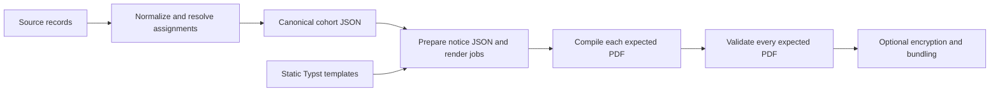

# Pipeline architecture

Python validates and normalizes the source records, resolves each notice's
version and language, and prepares localized display data. Maintained Typst
templates own the document source. Every expected PDF then passes through
validation and, when enabled, encryption and bundling.

## Disk contracts

The orchestrator passes paths and configuration between steps. Each step reads
its own disk inputs. The canonical cohort is ordered by school, last name, first
name, and client ID; its sequence numbers persist through all outputs.

| Step | Module | Output |
|---|---|---|
| 1 | `prepare_output.py` | Caller-selected output directories |
| 2 | `preprocess.py` | Canonical cohort and assignment metadata |
| 3 | `generate_qr_codes.py` | Optional QR PNGs |
| 4 | `generate_notices.py` | Per-notice JSON, staged static templates, `render_jobs.json` |
| 5 | `compile_notices.py` | Expected PDFs and whole-stage `compilation.json` |
| 6 | `validate_pdfs.py` | `metadata/validation_<run_id>.json` |
| 7 | `encrypt_notice.py` | Optional encrypted copies of expected PDFs |
| 8 | `bundle_pdfs.py` | Optional bundles and client-level manifests |
| 9 | `cleanup.py` | Configured removal of run-local intermediates |

## Assignment precedes presentation

The external manifest, canonical record, resolved notice, render payload, and
render job all use `version_id`. An explicit input `version_id` must agree with
the manifest's value. Reconciliation resolves
the assignment once and retains the result for preprocessing to attach without
discarding unrelated metadata.

Catalog defaults apply only at this boundary. Each client then carries its own
language through localization, QR construction, compilation, validation,
encryption, and bundling. The cohort header's `language` is the common language
when one exists, otherwise null. It is never a file-selection rule.

Fixed mode declares `legacy_overdue_v1` and needs no catalog. Its disease-based
notices remain distinct from the agent-based `overdue_standard_v1` notices.
Eligibility uses overdue diseases regardless of a template's presentation choice.

## Explicit rendering and output accounting

A `RenderJob` connects a canonical client to an unchanged entry point, a small
JSON input, a bounded workspace, and an expected PDF. Step 4 stages the selected
template tree once per run. No client-specific Typst source, wrapper script,
dynamic Python import, or source substitution is involved.

Typst 0.15.1 checks each template's literal version and language against the
payload. The compiler receives a data-file reference through `sys.inputs`.
All template imports, assets, JSON files, and QR images are beneath
`artifacts/render/`; the filesystem root is never used as Typst's file root.

Compilation removes old expected outputs and publishes each new PDF only after
its command succeeds. The whole-stage completion record appears only after all
jobs succeed. Assignment metadata alone is not evidence of compilation.
A failed job prevents downstream processing even when earlier jobs produced PDFs.

Validation consumes the expected paths and client IDs. Encryption uses the
same sequence/client mapping. Bundling verifies that the canonical cohort and
render jobs agree and that each expected notice appears exactly once in its
plans. Missing outputs fail; stale PDFs and encrypted copies are excluded.
Size, school, and board grouping remain unchanged, with no automatic language
split. A mixed-language bundle lists its actual languages in its manifest.

## Resources and custom templates

The wheel and source distribution include the templates, assets, and reference
configuration. Defaults are accessed through package resources. Input and output
defaults belong to the caller's working directory, not site-packages.
External configuration and `--templates PATH` work without a checkout.

A PHU's selected template directory is isolated. Shared helpers and assets stay
with its entry points. Read-only installed resources are copied into a removable,
run-local workspace. See the [authoring guide](../user_guide/phu_templates.md)
for the JSON contract and a single-notice compilation command.
