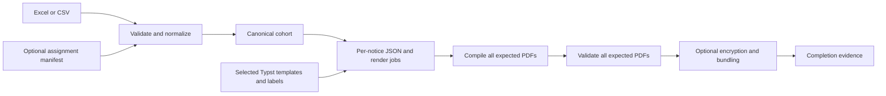

# Workflow and output evidence

`immuknow.orchestrator.run_pipeline` owns a complete run; `immuknow` is its CLI.
It loads selected configuration, validates source records and notice
assignments, and prepares an ordered canonical cohort. Disease normalization,
vaccine mapping, eligibility, age, grouping, and assignment reconciliation
remain in Python. Each client has one resolved `version_id` and language.

The cohort and render jobs persist under `artifacts/` when configured to retain
them. A render job names the client, sequence, version, language, selected
template, data path, bounded workspace, and expected PDF. Small JSON payloads
supply canonical facts; Typst formats dates, labels, dose wording, headings,
and notice prose. The selected template tree and language dictionaries are
staged once per run. No generated Typst source or client-specific wrapper is
needed. The [authoring guide](../user_guide/phu_templates.md) defines the JSON.

The renderer publishes a PDF only after compilation succeeds, then records
successful completion for the whole expected set. Validation checks each
expected PDF and its client ID, plus configured page and layout rules. An
error-level finding stops the run. Encryption and bundling use the same notice
set and check identity and uniqueness, not just counts. Stale PDFs and
encrypted duplicates are excluded. Language labels filenames but never filters
the cohort. Bundles can group by size, school, or board across languages.

Run metadata distinguishes assignments from successful compilation,
validation, and final delivery. Client-linked diagnostics are sensitive; store
them with the run's output. Installed library resources come from the
`immuknow` package; selected PHU configuration and templates can live
elsewhere. Writes go to the caller's output directory.
